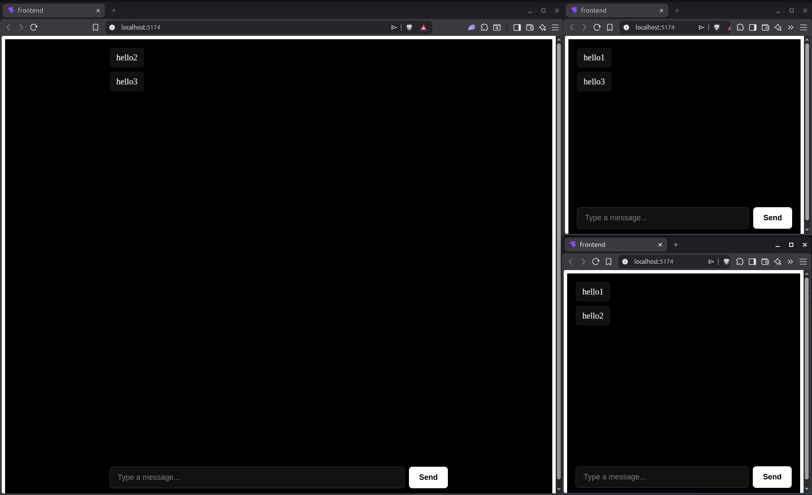
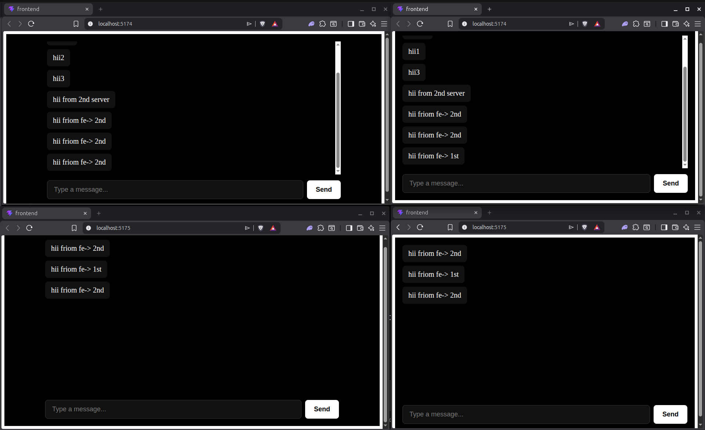
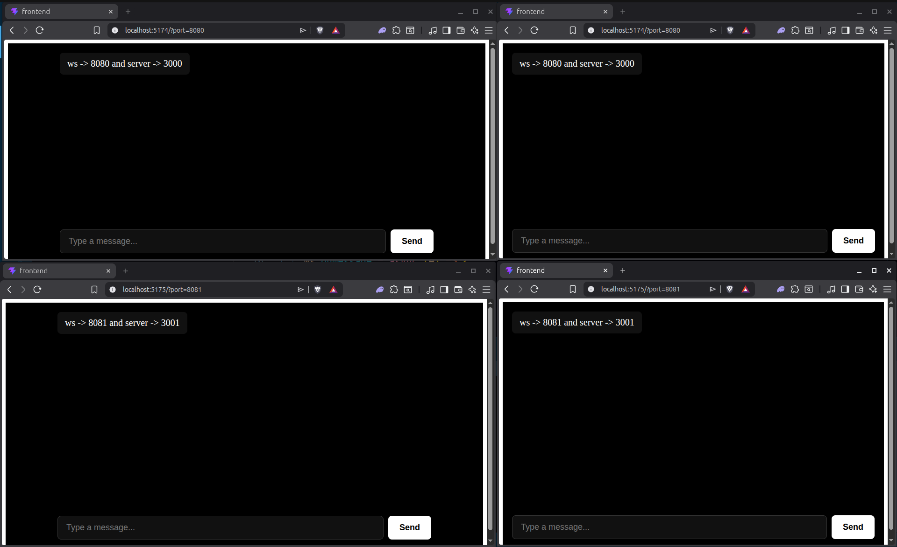
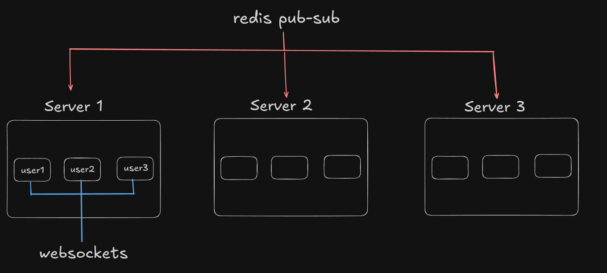
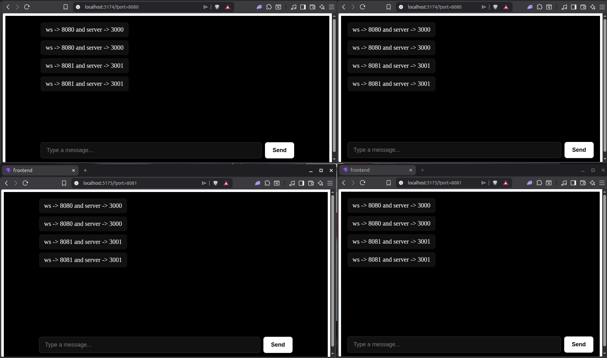

this is a simple implementation of redis pub-sub
this includes redis pub-sub and websockets , redis pub-sub is behaving like a connection unit for in the servers

this is a single server chat app , the usecase of pub-sub arises when there are more than 1 server

this is also a single server but different frontend ports

the things break with the 2 server architecture , when there sre 2 servers , there is no cross connection b/w the servers =>>>>>> here we will use redis pub-sub 

without redis poubsub there is no connection b/w the servers 

we got the desired result 

there can be further optimitizations but this is only V0 

setup guide 
change the ports on the server side 
and for ws port , pass that as search param 